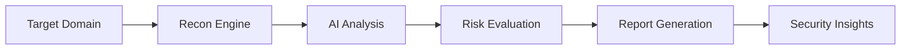

<p align="center">
  
</p>
---
# 🛡️ SentinelX-AI
### AI-Powered Security Analysis Platform
<p align="center">

```
███████╗███████╗███╗   ██╗████████╗██╗███╗   ██╗███████╗██╗     
██╔════╝██╔════╝████╗  ██║╚══██╔══╝██║████╗  ██║██╔════╝██║     
███████╗█████╗  ██╔██╗ ██║   ██║   ██║██╔██╗ ██║█████╗  ██║     
╚════██║██╔══╝  ██║╚██╗██║   ██║   ██║██║╚██╗██║██╔══╝  ██║     
███████║███████╗██║ ╚████║   ██║   ██║██║ ╚████║███████╗███████╗
╚══════╝╚══════╝╚═╝  ╚═══╝   ╚═╝   ╚═╝╚═╝  ╚═══╝╚══════╝╚══════╝

                        X - A I
```
</p>
<p align="center">
AI-powered reconnaissance • Automated analysis • Professional security reports
</p>

---

## 🚀 Overview

**SentinelX-AI** is an advanced AI-assisted cybersecurity analysis tool built for:

* 🕵️ Bug bounty hunters
* 🛡️ Security researchers
* 🎓 Cybersecurity students
* 🏢 Security teams
* 🤖 AI automation developers

The platform helps perform **authorized security testing** and generates **clear, structured vulnerability insights**.

> Designed for learning, research, and authorized penetration testing only.

---

## ✨ Key Features

### 🔍 Intelligent Recon Engine

* Subdomain discovery
* Endpoint mapping
* Technology detection
* Security header analysis
* Basic misconfiguration detection

### 🤖 AI Security Analysis

* AI-generated vulnerability explanation
* Beginner-friendly breakdown
* Risk understanding assistance
* Security awareness support

### 📊 Professional Report System

* Structured findings format
* Risk classification
* Clear recommendations
* Export-ready report structure

### 🔐 Ethical Usage Focus

* Built for authorized testing environments
* Educational explanation support
* Responsible disclosure friendly

---

## 🧠 Workflow



---

## 📂 Project Structure

```
SentinelX-AI/
│
├── core/
│   ├── scanner/
│   ├── analyzer/
│   └── report_engine/
│
├── ai/
│   └── intelligence_module/
│
├── ui/
│   └── dashboard/
│
├── docs/
│   └── documentation.md
│
└── README.md
```

---

## ⚙️ Installation

```bash
git clone https://github.com/yourusername/SentinelX-AI.git

cd SentinelX-AI

pip install -r requirements.txt
```

---

## ▶️ Basic Usage

```bash
python sentinelx.py --target example.com
```

---

## 📊 Example Result

```
Target: example.com

Findings:
• Missing security headers
• Exposed technology stack
• Possible misconfiguration

Risk Level: Medium

Recommendation:
Review server configuration and apply security best practices.
```

---

## 🛣️ Roadmap

* AI vulnerability reasoning upgrade
* CVSS auto scoring
* PDF report export
* Web dashboard UI
* API integration
* Multi-user collaboration
* Subscription system
* Donation integration

---

## 🤝 Contribution

Contributions are welcome from the security community.

Steps:

1. Fork repository
2. Create feature branch
3. Commit changes
4. Submit pull request

---

## ⚠️ Legal Disclaimer

SentinelX-AI must only be used on systems you own or have explicit permission to test.

Unauthorized security testing may violate laws and regulations.

The developer is not responsible for misuse.

---

## ⭐ Support Project

If this project helps you:

Give it a ⭐ on GitHub
Share with security researchers
Support ethical cybersecurity learning

---

## 🔥 Vision

Making cybersecurity research faster, smarter, and more accessible using AI.

---

চাও হলে আমি এগুলাও তৈরি করে দিতে পারি:

* GitHub badge section
* Logo prompt (AI generate)
* Landing page design text
* Full documentation.md
* Contribution guideline
* License file
* Project tagline options

1. Install dependencies:
   `npm install`
2. Set the `GEMINI_API_KEY` in [.env.local](.env.local) to your Gemini API key
3. Run the app:
   `npm run dev`
